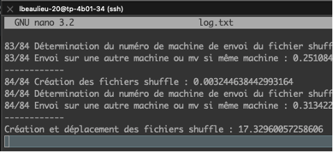
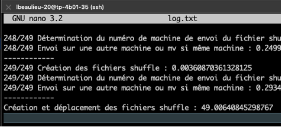
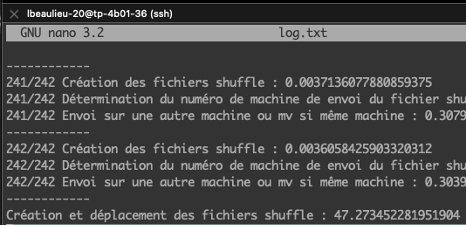
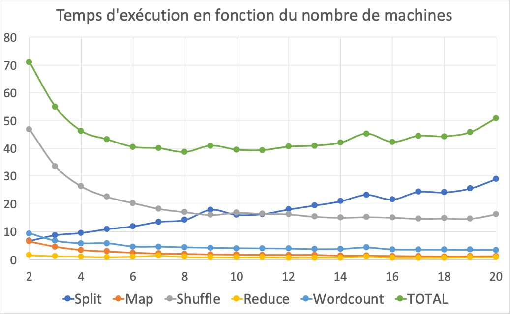
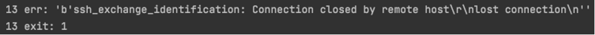

<h1 align=center>Conception d'une maquette basée sur le système MapReduce</h1>

<i>Remarque préliminaire : le code source de ce projet est disponible dans les différents fichiers * .py de ce repo.</i>

<h2>Table des matières</h2>

<ol>
    <li><a href="#ref1">Présentation du projet</a></li>
    <li><a href="#ref2">Programme initial</a>
    	<ol>
    		<li><a href="#ref21">Description du programme</a></li>
    		<li><a href="#ref22">Mesure des temps de calcul</a></li>
    	</ol>
    </li>
    <li><a href="#ref3">Programme amélioré</a></li>
	    <ol>
	    	<li><a href="#ref31">Description des évolutions apportées</a></li>
	    	<li><a href="#ref32">Mesure des temps de calcul</a></li>
	    </ol>
  	</li>
    <li><a href="#ref4">Analyses croisées</a></li>
	    <ol>
	    	<li><a href="#ref41">Taille de cluster variable – taille de fichier constante</a></li>
	    	<li><a href="#ref42">Taille de cluster constante – taille de fichier variable</a></li>
	    	<li><a href="#ref43">Conclusion</a></li>
	    </ol>
  	</li>
    <li><a href="#ref5">Discussion : pistes d'amélioration</a></li>
</ol>

<h2 id="ref1">1. Présentation du projet</h2>

Ce document a pour vocation d’expliquer les étapes d’implémentation de MapReduce, les problèmes rencontrés et de proposer des pistes d’améliorations. Cette étude se base sur le développement et l’exécution d’un algorithme de wordcount. 2 programmes ont été créés afin de comparer les vitesses d’exécution :

- Un programme de calcul non-distribué 
- Un programme de calcul distribué 

La première version du programme de calcul distribué suit les 13 étapes de l’énoncé du projet. Des modifications ont par la suite été apportées afin d’améliorer la vitesse d’exécution.
3 machines ont été utilisées pour les premiers tests. Le nombre de machines a ensuite été modulé afin de déterminer la taille de cluster optimale pour l’exécution du programme.
Une fois le cluster bien dimensionné, une analyse comparée avec le programme non-distribué a été réalisée avec des fichiers de différentes tailles afin de mettre en lumière l’intérêt et les limites des 2 méthodes.
Des pistes d’améliorations complémentaires (non testées) sont proposées en fin de document.

<h2 id="ref2">2. Programme initial</h2>
<h4 id="ref21">2.1. Description du programme</h4>

Deux programmes **clean.py** et **deploy.py** ont été créés afin de réinitialiser les machines avant l’exécution du programme (test de connexion, suppression du contenu présent dans l’espace dédié au calculs, création des répertoires de travail, déploiement du programme sur les machines utilisées).
Un programme **master.py**, couplé à un programme **slave.py**, est chargé d’exécuter les différentes tâches de l’algorithme sur le cluster.
Les programmes **clean.py, deploy.py et master.py** sont situés sur une machine distante du cluster ; le fichier **slave.py** est répliqué sur chaque machine du cluster.
Le fichier d’entrée **input.txt** est situé sur la machine distante.

<table>
  <tr>
    <th bgcolor=#e6f5ff>Etape</th>
    <th bgcolor=#e6f5ff>Description</th>
  </tr>
  <tr>
    <td><b>Initialisation</b></td>
    <td>
    	<ul>
		    <li>Envoi du fichier de composition du cluster sur chaque machine</li>
		    <li>Vérification d’existence et création éventuelle des différents répertoires</li>
		    <li>Découpage du fichier d’entrée en un nombre de fichiers Sx.txt égal au nombre de machines du cluster</li>
		    <li>Envoi des fichiers Sx.txt sur la machine master</li>
  		</ul>
  	</td>
  </tr>
  <tr>
    <td><b>Split</b></td>
    <td>
    	<ul>
		    <li>Copie des fichiers Sx.txt depuis la machine master vers les autres machines</li>
  		</ul>
  	</td>
  </tr>
  <tr>
    <td><b>Map (*)</b></td>
    <td>
    	<ul>
		    <li>Création des fichiers maps UMx.txt à partir des fichiers splits Sx.txt (1 par machine)</li>
  		</ul>
    </td>
  </tr>
  <tr>
    <td><b>Shuffle (*)</b></td>
    <td>
    	<ul>
		    <li>Lecture des mots contenus dans chaque fichier UMx.txt</li>
		    <li>Création d’une table de correspondance mot - hash</li>
		    <li>Création des fichiers shuffle <hash>-<hostname_machine>.txt contenant le mot correspondant, dupliqué n fois (n = nombre d’occurrences du mot dans UMx.txt)</li>
		    <li>Détermination des numéros de machines cibles des shuffles (<hash> % nombre de machines)</li>
		    <li>Envoi des shuffles sur les machines cibles</li>
  		</ul>
    </td>
  </tr>
  <tr>
    <td><b>Reduce (*)</b></td>
    <td>
    	<ul>
		    <li>Création d’un fichier unique par hash contenant le mot correspondant et son nombre d’occurrences décompté dans tous les shuffles (remarque : à cette étape, un mot est situé sur une unique machine)</li>
  		</ul>
    </td>
  </tr>
  <tr>
    <td><b>Wordcount</b></td>
    <td>
    	 <ul>
		    <li>Rassemblement des correspondances mot - décompte dans un fichier unique par machine</li>
		    <li>Copie de ce fichier unique sur la machine master</li>
		    <li>Rassemblement du contenu de chaque fichier reçu en un nouveau fichier unique sur la machine master</li>
  		</ul>
    </td>
  </tr>
</table>
<i>( * ) Etapes réalisées en parallèle sur toutes les machines du cluster</i>

<h4 id="ref22">2.2. Mesure des temps de calcul</h4>

Les calculs sont réalisés sur 3 machines. La mesure des temps de calcul de chaque étape a été réalisée en premier lieu sur des fichiers de petite taille :

<table>
  <caption><b>Temps de traitement par étape (en secondes)</b></caption>
  <tr>
    <th bgcolor=#e6f5ff>Etape</th>
    <th bgcolor=#e6f5ff>Code forestier de Mayotte (85 lignes – 1 Ko)</th>
    <th bgcolor=#e6f5ff>Code déontologie de la police nationale (283 lignes – 7 Ko)</th>
    <th bgcolor=#e6f5ff>Ecart</th>
  </tr>
  <tr>
    <td><b>Initialisation</b></td>
    <td>3.41557</td>
    <td>3.28983</td>
    <td>-4%</td>
  </tr>
  <tr>
    <td><b>Split</b></td>
    <td>2.1805</td>
    <td>2.08219</td>
    <td>-5%</td>
  </tr>
  <tr>
    <td><b>Map</b></td>
    <td>0.35807</td>
    <td>0.35072</td>
    <td>-2%</td>
  </tr>
  <tr>
    <td><b>Shuffle</b></td>
    <td>13.17685</td>
    <td>49.62993</td>
    <td>+277%</td>
  </tr>
  <tr>
    <td><b>Reduce</b></td>
    <td>0.38157</td>
    <td>0.39738</td>
    <td>+4%</td>
  </tr>
  <tr>
    <td><b>Wordcount</b></td>
    <td>2.24885</td>
    <td>2.15407</td>
    <td>-4%</td>
  </tr>
  <tr>
    <td><b>TOTAL</b></td>
    <td><b>21.76143</b></td>
    <td><b>57.90415</b></td>
    <td><b>+166%</b></td>
  </tr>
</table>

Ces premiers tests montrent que la taille du fichier d’entrée n’impacte que la **phase de shuffle** de manière significative. Plus précisément, l’étape de déplacement des fichiers de shuffle sur la bonne machine prend la quasi-totalité du temps de traitement (les déplacements sont effectués un par un).
Le temps de calcul élevé ne permet pas d’envisager le traitement de fichiers de taille plus importante que quelques Ko.

<figcaption><i>Figure 1 - logs de l'étape de shuffle sur les 3 machines</i></figcaption>

<i>Remarque : le temps de traitement total de la phase de shuffle est approximativement égal au temps de traitement pour la machine disposant du plus grand nombre de fichiers. Cette observation rend bien compte de la parallélisation des calculs entre les 3 machines.</i>

<h2 id="ref3">3. Programme amélioré</h2>

<h4 id="ref31">3.1. Description des évolutions apportées</h4>

L’étude des temps de calcul du premier programme et de la structure du code a permis de mettre en place les améliorations suivantes :

- Définition des numéros de machine du cluster directement dans le code (utile pour les analyses croisées réalisées plus tard),
- Suppression des étapes de vérification d’existence des répertoires, redondantes avec le programme deploy.py,
- Réalisation des opérations de split directement sur la machine master (le fichier d’entrée est au préalable téléchargé sur la machine master),
- Envoi des shuffles sur les machines cibles par paquets et non plus un par un.

<table>
  <tr>
    <th bgcolor=#e6f5ff>Etape</th>
    <th bgcolor=#e6f5ff>Description</th>
  </tr>
  <tr>
    <td><b>Split</b></td>
    <td>
      <ul>
        <li>Découpage du fichier d’entrée en un nombre de fichiers Sx.txt égal au nombre de machines du cluster</li>
        <li>Copie des fichiers Sx.txt depuis la machine master vers les autres machines</li>
      </ul>
    </td>
  </tr>
  <tr>
    <td><b>Map (*)</b></td>
    <td>
      <ul>
        <li>Création des fichiers maps UMx.txt à partir des fichiers splits Sx.txt (1 par machine)</li>
      </ul>
    </td>
  </tr>
  <tr>
    <td><b>Shuffle (*) (**)</b></td>
    <td>
      <ul>
        <li>Lecture des mots contenus dans chaque fichier UMx.txt</li>
        <li>Création d’une table de correspondance mot – hash – machine cible</li>
        <li>Création d’un unique fichier shuffle par machine cible contenant les mots correspondants, dupliqués n fois (n = nombre d’occurrences du mot dans UMx.txt)</li>
        <li>Envoi des shuffles sur les machines cibles</li>
      </ul>
    </td>
  </tr>
  <tr>
    <td><b>Reduce (*)</b></td>
    <td>
      <ul>
        <li>Concaténation des shuffles reçus (remarque : à cette étape, un mot est situé sur une unique machine)</li>
      </ul>
    </td>
  </tr>
  <tr>
    <td><b>Wordcount</b></td>
    <td>
       <ul>
        <li>Réalisation d’un premier wordcount sur chaque machine à partir des fichiers de l’étape Reduce</li>
        <li>Copie des wordcounts sur la machine master</li>
        <li>Concaténation des wordcounts en un fichier unique</li>
      </ul>
    </td>
  </tr>
</table>
<i>( * ) Etapes réalisées en parallèle sur toutes les machines du cluster</i> 
<i>( ** ) On passe d’un fichier par mot à un fichier par machine</i>

<h4 id="ref32">3.2. Mesure des temps de calcul</h4>

<table>
  <caption><b>Evolution du temps de traitement du code de la police nationale (283 lignes – 7 Ko)</b></caption>
  <tr>
    <th bgcolor=#ddf7d4>Etape</th>
    <th bgcolor=#ddf7d4>Programme initial</th>
    <th bgcolor=#ddf7d4>Programme amélioré</th>
    <th bgcolor=#ddf7d4>Ecart</th>
  </tr>
  <tr>
    <td><b>Initialisation</b></td>
    <td>3.28983</td>
    <td>-</td>
    <td rowspan=2>-56%</td>
  </tr>
  <tr>
    <td><b>Split</b></td>
    <td>2.08219</td>
    <td>2.37566</td>
  </tr>
  <tr>
    <td><b>Map</b></td>
    <td>0.35072</td>
    <td>0.32853</td>
    <td>-6%</td>
  </tr>
  <tr>
    <td><b>Shuffle</b></td>
    <td>49.62993</td>
    <td>0.99523</td>
    <td>-98%</td>
  </tr>
  <tr>
    <td><b>Reduce</b></td>
    <td>0.39738</td>
    <td>0.34751</td>
    <td>-13%</td>
  </tr>
  <tr>
    <td><b>Wordcount</b></td>
    <td>2.15407</td>
    <td>1.28626</td>
    <td>-40%</td>
  </tr>
  <tr>
    <td><b>TOTAL</b></td>
    <td><b>57.90415</b></td>
    <td><b>5.33324</b></td>
    <td><b>-91%</b></td>
  </tr>
</table>

Les améliorations apportées ont un impact très significatif sur les temps de calculs. En particulier, le temps de shuffle a été réduit de 98%. Comme les autres phases n’étaient initialement que peu impactées par la taille du fichier, cela permet d’envisager le traitement de l’extrait Common Crawl (381 Mo) proposé dans l’énoncé du projet.

<table>
  <caption><b>Temps de traitement par étape (en secondes)</b></caption>
  <tr>
    <th bgcolor=#e6f5ff>Etape</th>
    <th bgcolor=#e6f5ff>CC-MAIN-20170322212949-00140-ip-10-233-31-227.ec2.internal.warc.wet
(381 Mo)</th>
  </tr>
  <tr>
    <td><b>Split</b></td>
    <td>8.75308</td>
  </tr>
  <tr>
    <td><b>Map</b></td>
    <td>4.6811</td>
  </tr>
  <tr>
    <td><b>Shuffle</b></td>
    <td>33.57714</td>
  </tr>
  <tr>
    <td><b>Reduce</b></td>
    <td>1.23054</td>
  </tr>
  <tr>
    <td><b>Wordcount</b></td>
    <td>6.75463</td>
  </tr>
    <tr>
    <td><b>TOTAL</b></td>
    <td><b>54.99652</b></td>
  </tr>
</table>

La version améliorée du programme a permis de réaliser le traitement de l’extrait Common Crawl (381 Mo) avec un cluster de 3 machines en un temps acceptable de 55 secondes.
Il convient désormais d’effectuer une analyse croisée pour déterminer le nombre de machines optimal pour le fonctionnement du programme de calcul distribué.

<h2 id="ref4">4. Analyses croisées</h2>

<h4 id="ref41">4.1. Taille de cluster variable – taille de fichier constante</h4>

Le programme a été exécuté sur le même fichier de 381 Mo pour différentes tailles de cluster :

<figcaption><i>Figure 2 - Graphique des temps d'exécution mesurés pour différentes tailles de cluster</i></figcaption>

Le temps d’exécution du programme semble optimal pour un cluster de 8 à 11 machines.
Par ailleurs, des pannes aléatoires surviennent régulièrement à partir de 15 machines dans le cluster :

<figcaption><i>Figure 3 - Illustration d'une panne survenant lors de l'exécution sur un cluster de 18 machines</i></figcaption>

Afin de limiter le risque de panne au sein du cluster, on peut choisir un cluster de 8 machines pour le traitement d’un fichier d’environ 400 Mo.

<h4 id="ref42">4.2. Taille de cluster constante – taille de fichier variable</h4>

Afin de comparer les performances du programme de calcul distribué par rapport à un programme non distribué, un algorithme de comptage non-distribué **wordcount_single.py** a été créé. Des fichiers de tailles différentes sont utilisés : l’extrait Common Crawl (381 Mo) exploité précédemment, ainsi qu’une concaténation de plusieurs extraits issus de la même source. Les tailles respectives sont de 1.5 Go et 3 Go.
Par ailleurs, on cherche à vérifier si la taille du fichier influence la taille optimale pour le cluster. Pour cela, 2 tailles de clusters sont comparées : un cluster à 8 machines et un cluster à 16 machines.

<table>
  <caption><b>Evolution du temps de traitement du code de la police nationale (283 lignes – 7 Ko)</b></caption>
  <tr>
    <th bgcolor=#ddf7d4>Programme</th>
    <th bgcolor=#ddf7d4>381 Mo</th>
    <th bgcolor=#ddf7d4>1.5 Go</th>
    <th bgcolor=#ddf7d4>3 Go</th>
  </tr>
  <tr>
    <td><b>Cluster 16 machines</b></td>
    <td>42.2869</td>
    <td>127.1595</td>
    <td>222.1236</td>
  </tr>
  <tr>
    <td><b>Cluster 8 machines</b></td>
    <td>38.6960</td>
    <td>119.6965</td>
    <td>396.6973</td>
  </tr>
  <tr>
    <td><b>Non-distribué</b></td>
    <td>12.8159</td>
    <td>137.0967</td>
    <td>Timeout</td>
  </tr>
</table>

<h4 id="ref43">4.3. Conclusion</h4>

- Le calcul distribué a un intérêt lorsque la taille du jeu de données est importante,
- Il existe une taille optimale de cluster pour un type de calcul (ici, pour une taille de fichier donnée),
- L’augmentation de la taille du jeu de données semble influencer à la hausse la taille optimale du cluster.

<h2 id="ref5">5. Discussion : pistes d’amélioration</h2>

Il est encore possible d’améliorer le programme afin de maximiser sa vitesse de calcul et sa robustesse, par exemple :

- Copie des splits sur les machines en parallèle,
- Utilisation d’un nombre différent de machines pour les différentes phases (ex : 15 machines pour le split, 10 machines pour le shuffle),
- Dimensionnement automatique du cluster en fonction de la taille du fichier,
- Connexion automatique à un nombre de machines donné en début de programme (avec réallocation des connexions échouées),
- Gestion d’une panne de machine et réallocation des calculs pendant l’exécution, suivant le principe utilisé dans la version originale de MapReduce **( * )** (3.3 Fault Tolerance).

L’une des étapes structurantes du programme créé est le split en fonction du nombre de machines du cluster. Or, la version originale de MapReduce utilise des tailles de splits standardisée à 64 Mo et dimensionne le cluster à partir du nombre de blocs créés, comme indiqué dans l’article « MapReduce: Simplified Data Processing on Large Clusters » de Jeffrey Dean et Sanjay Ghemawat **( * )** (page 4). Il pourrait être intéressant de tester cette approche. Pour le fichier de 381 Mo, cela correspondrait à un cluster de 6 machines (dont le temps de calcul approche le temps optimal comme vu plus haut).

( * ) https://research.google.com/archive/mapreduce-osdi04.pdf
